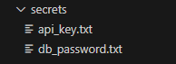
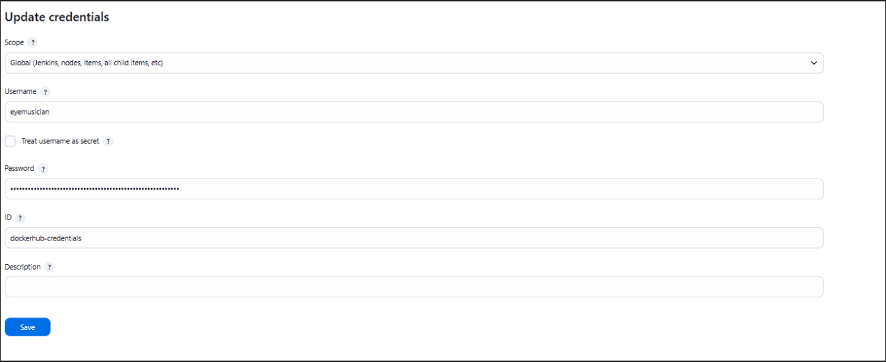
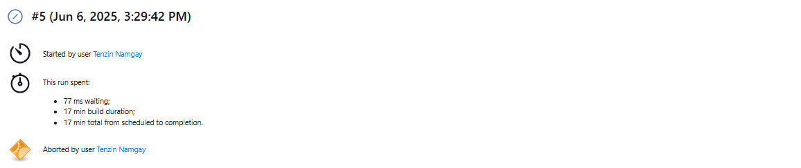
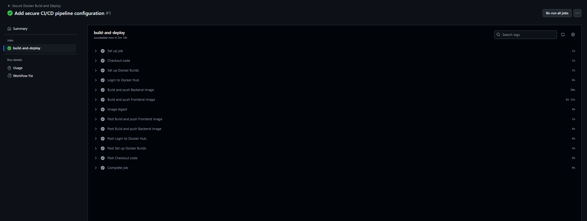
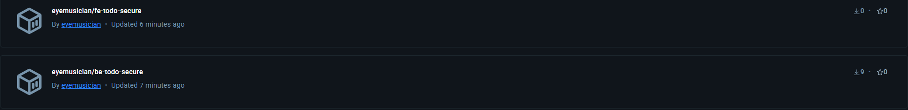
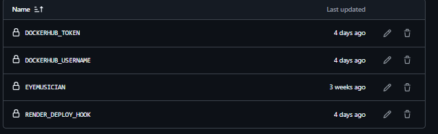
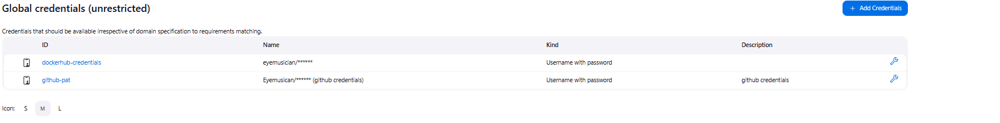
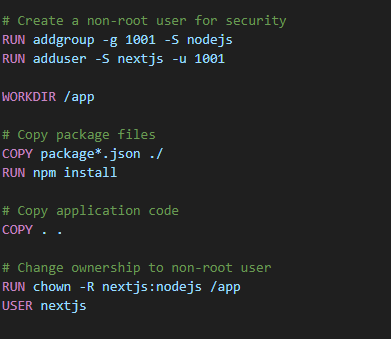
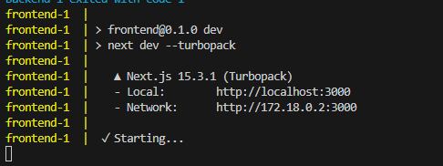

## Assignment IV: Secure CI/CD Pipeline with Docker, Jenkins, and GitHub Actions

This assignment demonstrates how to integrate security best practices into CI/CD workflows using:

1. Docker: non-root users and secret management

2. Jenkins: secure DockerHub credential management

3. GitHub Actions: secret handling and secure image deployment


### Docker Security Enhancements

#### Non-Root User Implementation

1. I Updated both frontend/Dockerfile and backend/Dockerfile to run as a non-root user (nextjs) to reduce security risks.

2. Changed ownership of app files to the non-root user before switching to that user.
Non-Root User Implementation

##### Backend Dockerfile Security Features:

```
# backend/Dockerfile
FROM node:18-alpine

# Create a non-root user for security
RUN addgroup -g 1001 -S nodejs
RUN adduser -S nextjs -u 1001

WORKDIR /app

# Copy package files
COPY package*.json ./
RUN npm install

# Copy application code
COPY . .

# Change ownership to non-root user
RUN chown -R nextjs:nodejs /app
USER nextjs

EXPOSE 5000

# Direct node command
CMD ["node", "dist/index.js"]

```
##### frontend Dockerfile Security Features: 

```
# frontend/Dockerfile
FROM node:18-alpine

# Create a non-root user for security
RUN addgroup -g 1001 -S nodejs
RUN adduser -S nextjs -u 1001

WORKDIR /app

# Copy package files
COPY package*.json ./
RUN npm install

# Copy application code
COPY . .

# Build the application
RUN npm run build

# Change ownership to non-root user
RUN chown -R nextjs:nodejs /app
USER nextjs


EXPOSE 3000
CMD ["npm", "run", "dev"]

```

### Docker Secrets Management

I Used Docker secrets to store sensitive data instead of hardcoding them in images.



Added mock secrets for demo purposes:

1. **secrets/db_password.txt** : Mock database password

2. **secrets/api_key.txt** : Mock API key


In **docker-compose.yml**, I mounted those secrets as files inside the container.

```
services:
  backend:
    image: eyemusician/be-todo-secure:02230307  
    secrets:
      - db_password
      - api_key
    environment:
      - DB_PASSWORD_FILE=/run/secrets/db_password
      - API_KEY_FILE=/run/secrets/api_key
    ports:
      - "5000:5000"

  frontend:
    image: eyemusician/fe-todo-secure:02230307  
    ports:
      - "3000:3000"
    environment:
      - REACT_APP_API_URL=http://localhost:5000

secrets:
  db_password:
    file: ./secrets/db_password.txt
  api_key:
    file: ./secrets/api_key.txt

```


Why Mock Secrets?
- This is just my understanding to show secure practices.


### Jenkins Secure Pipeline Setup

1. Credential Management

Jenkins Dashboard → Credentials → Global → Add Credentials : 

1. I stored DockerHub username and Personal Access Token securely
2. Credential ID used: dockerhub-credentials





### Security Features in Jenkinsfile:

My Jenkins pipeline took quite a long time to build (around 17 minutes), and due to system limitations, I had to manually abort it before completion.




But the pipeline was set up properly and included all the required steps and security features.

1. **Secret scanning** to  check for hardcoded secrets

2. **Non-root validation** : Verifies containers run as non-root users

3. **Secure deployment** : Only deploys from main branch

4. **Cleanup** to remove local images and clear build cache

### GitHub Actions Secure Workflow

#### Repository Secrets Configuration

1. GitHub Secrets stored under: Settings → Secrets and Variables → Actions
```
DOCKERHUB_USERNAME: DockerHub username
DOCKERHUB_TOKEN: DockerHub Personal Access Token
```
#### Workflow Security Features:

In my GitHub Actions workflow, I configured the following security and deployment enhancements:

 1. **Conditional deployment**: The workflow only pushes images from the `main`
 branch.

 2. **Secure authentication**: I used GitHub repository secrets to securely authenticate with DockerHub (`DOCKERHUB_USERNAME` and `DOCKERHUB_TOKEN`).
 3. **Multi-platform builds**: I configured the builds to target `linux/amd64` platform for compatibility.
 4.  **Proper image tagging**: I tagged all Docker images using my student ID (`02230307`) for traceability.

### Successful Workflow Run:

The image below shows a successful run of my secure GitHub Actions CI/CD pipeline. Every step from checkout to pushing frontend and backend images was completed without errors:



### Deployment Results:



* DockerHub Backend image: `eyemusician/be-todo-secure:02230307`


* DockerHub Frontend image: `eyemusician/fe-todo-secure:02230307`

### Security Best Practices Implemented


To make sure my CI/CD pipelines and Docker containers are secure, I followed these security measures:

####  Credential Security
I made sure to never hardcode any passwords or API keys in my code.
Instead, I stored all sensitive data using:

1. **GitHub Secrets for GitHub Actions workflows** : 
I added secrets like DOCKERHUB_USERNAME, DOCKERHUB_TOKEN, RENDER_DEPLOY_HOOK, and others under the repository settings. You can see this in the screenshot below:



2. **Global Jenkins Credentials for Jenkins pipelines** : 
For the Jenkins setup, I added credentials like my DockerHub and GitHub personal access tokens. These were stored under the "Global credentials" section in Jenkins as shown below:



For the sake of this assignment, I used mock secrets (such as fake API keys and passwords), just to demonstrate the correct security practices without exposing any real data.


#### Container Security


I added extra steps in both Dockerfiles to run everything as a non-root user, which makes the containers safer.



I also used lightweight base images like node:18-alpine and made sure all the files inside the container are owned by the correct user.


#### Local Deployment Verification 
After running docker-compose up, I was able to verify that my frontend was deployed correctly and accessible on http://localhost:3000. Below is a snippet from the console output:




### Challenges Faced and Solutions

#### Challenge 1: Docker Secrets vs Environment Variables
1. Issue: I initially considered using environment variables for secrets but realized this wasn't secure enough.

2. Solution: I implemented Docker secrets mounting as files instead for better security.

3. Why: Files are more secure than environment variables which can be exposed in process lists.


#### Challenge 2: Jenkins Pipeline Windows Commands

1. Issue: My pipeline needed to work on Windows Jenkins agent, but I was using Linux commands.

2. Solution: I used bat commands instead of sh commands throughout my Jenkinsfile.
Implementation:

```
bat 'docker build -t ${BACKEND_IMAGE} -f to-do/Dockerfile to-do/'

```

#### Challenge 3: PC Freezes When Using Docker
1. Issue :
My PC would freeze or become very slow when running Docker commands like building images or starting containers.

2. Solution:
I reduced CPU and memory allocation for Docker in Docker Desktop settings, closed unnecessary apps to free resources, and used lightweight Docker images to lower system load.


#### Challenge 4: Alpine Linux User Management Commands

1. Issue: When I tried creating non-root users in Alpine-based Docker images, the standard Linux commands didn't work.

```
/bin/sh: groupadd: not found
/bin/sh: useradd: not found
```

2. Solution: I used Alpine-specific commands instead:

```
# What I tried first (didn't work)
RUN groupadd -r appgroup && useradd -r -g appgroup appuser

# What actually worked
RUN addgroup -g 1001 -S nodejs
RUN adduser -S nextjs -u 1001

```


This assignment really helped me understand how to add security in a CI/CD pipeline. I learned how to run Docker containers as non-root users and used Docker secrets to keep sensitive data safe. In Jenkins, I stored DockerHub credentials properly and added steps to check for security issues.

With GitHub Actions, I used repository secrets and made sure it only deployed from the main branch. I also used mock secrets to show how to manage real ones safely.